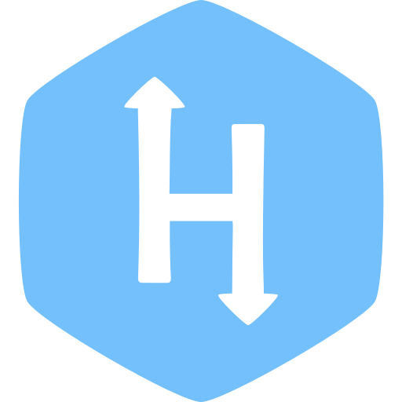

  
<!-- <a>&emsp;&emsp;</a>
   -->
    <a href="https://github.com/YasserFat7alah">
      <h1 align="center" > Hi 👋, I'm Mohamed Azmi</h1>
    </a>

 

### 🤓 Who am I? (Briefly):

- 🔭 Fullstack developer at Intlaq!

- 🌱 I’m currently learning **Backend Development & Software Development**

- 👯 I’m looking to collaborate with other developers

- 💬 Ask me about **Django & Python**

- 📫 How to reach me **pydevazmi@gmail.com**

- 📄 Take a look at [ My Portfolio](https://pydevazmi.github.io/#home)

 

    
### 👨‍💻Connect with me

    &nbsp;&nbsp;
    
    &nbsp;&nbsp; 
    
    &nbsp;&nbsp;
    
    &nbsp;&nbsp; 
    
    &nbsp;&nbsp;
    
    &nbsp;&nbsp;
    

    Interested in my work?
    <a href="https://www.buymeacoffee.com/pydevazmi" target="_blank" style= 'font-weight: bold; font-size:14px'>Buy Me A Coffe.
</a>

<!--

-->
 

### 🏆 Github trophies

  

 

<h3 align="left"> Languages and Tools:</h3>

 

   
  &nbsp;
   
  &nbsp;
  
  &nbsp;
  
  &nbsp;
  
  &nbsp;
  
  &nbsp;
  
  &nbsp;
  
  &nbsp;
  
  &nbsp;
  
  &nbsp;
  
  &nbsp;
   
  &nbsp;
  
  &nbsp;
  
  &nbsp;
  
  &nbsp;
  
  &nbsp;
  
  &nbsp;
  
  &nbsp;
   
  &nbsp;
  
  &nbsp;
   
  &nbsp;
   
  &nbsp;

 

### 👦 Github Stats:

 

 

